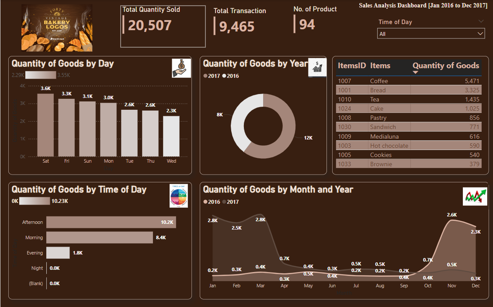
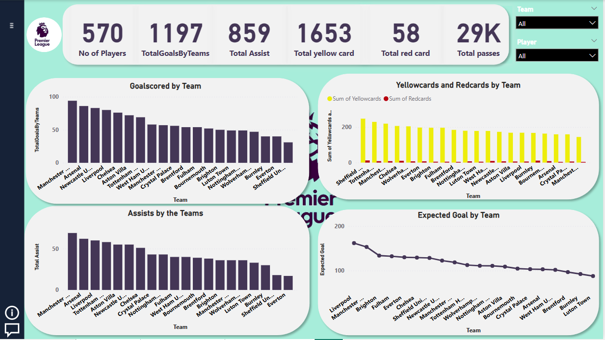
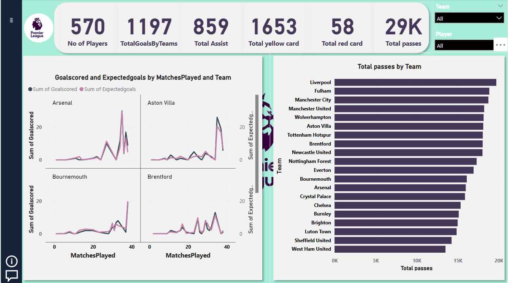
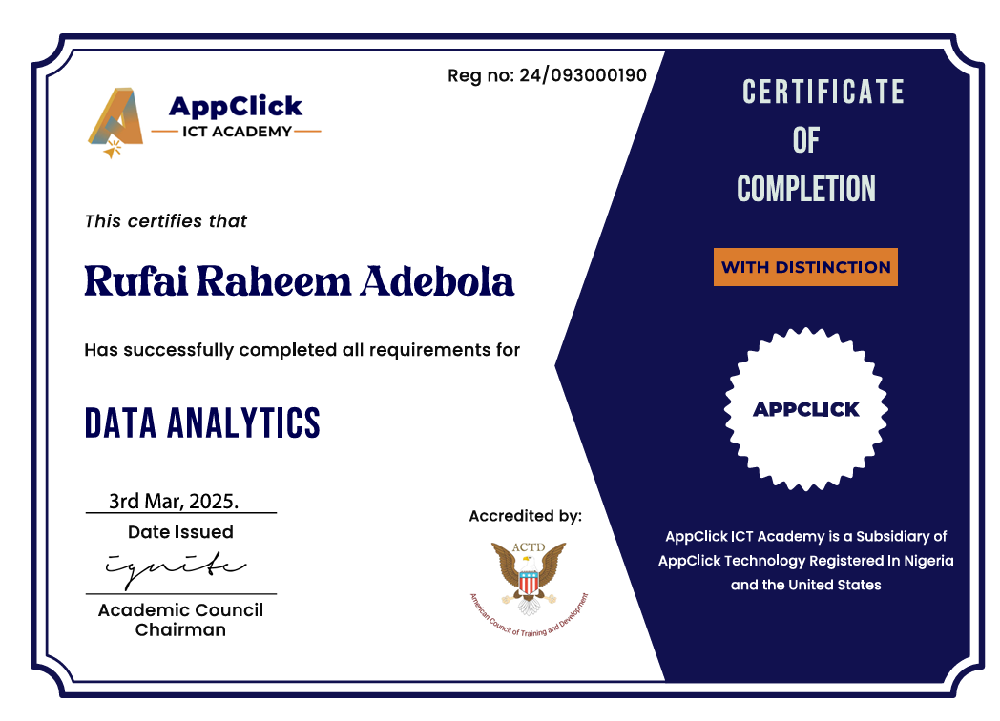
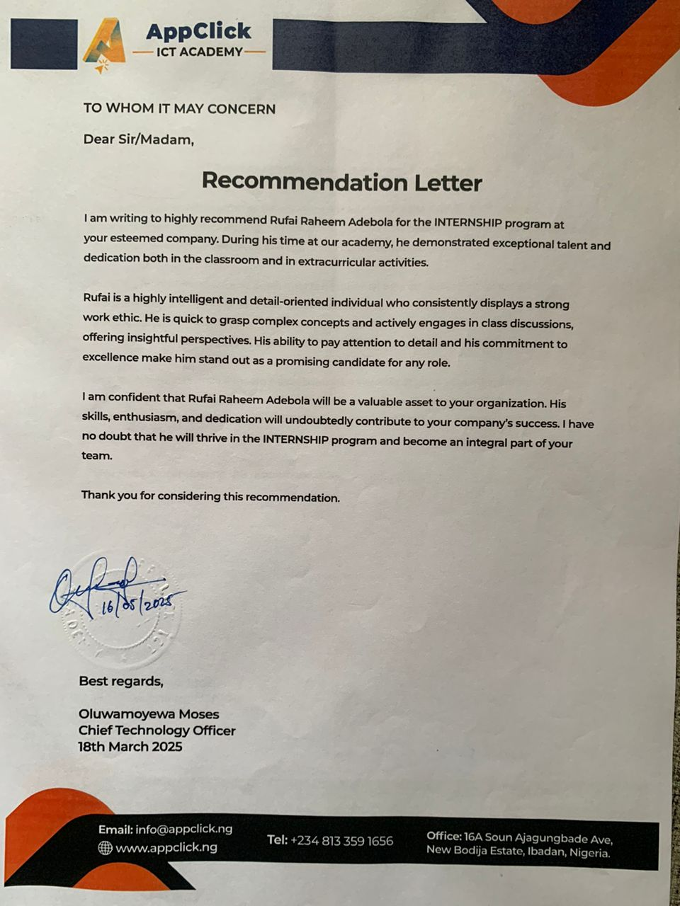

<!-- selection 1: Introduce yourself -->
## MY_PORTFOLIO

## ABOUT

 Hello, I am Rufai Raheem Adebola, hails from Ogun state, Nigeria. A highly motivated and detail-oriented graduate with a Higher National Diploma (HND) in Banking and Finance from The Polytechnic Ibadan. With a strong foundation in financial principles, risk management and insight, and an emerging expertise in data analysis, I am passionate about leveraging technology to drive insights and improve decision-making processes.

## MY SKILLS 

**Data Analysis: Python, SQL, Power BI, and Excel.
Data Visualization and Cleaning.
Financial Analysis and Reporting.
Problem-Solving and Critical Thinking.
Eagerness to Learn and Adapt.**

<!--Section 2: List 3-6 Key projects -->
## MY PROJECT

Performed data cleaning on the Bakery dataset, analyze using key performance indicators (KPIs) of sales, and determine the organization's profit across different days of sales.
Dataset originated - Kaggle.com
Tools used - Microsoft Power BI
Data cleaning and Visualization - Microsoft Power BI.

English Premier League analysis of 2023/2024 season, for the performance of each clubs and players for the whole season.
Dataset originated - Kaggle.com
Tools used - Microsoft Power BI
Data cleaning - Microsoft Excel.

[ReadMore](https://www.linkedin.com/feed/update/urn:li:activity:7290888425598029825/)

## CERTIFICATION

Certification of completion of a course is not just a piece of paper or documents but a dedication and hardwork to vent on new opportunities.
[Read More](https://www.linkedin.com/feed/update/urn:li:activity:7308861528642854913/)

## RECOMMENDATION.
It is a privilege to present my recommendation letter as a testament to my skills and expertise in Data Analysis. This serves as a valuable certification, enabling me to demonstrate my knowledge in any organization I find myself in. I remain open to new challenges and opportunities for growth.

## CONTACT DETAILS
_Lets see how we can be of benefit to one another_

________________________________________________________________________
<table>    adebola.rufai@gmail.com </table>
________________________________________________________________________
<table>     (234)-814-736-2706 </table>
________________________________________________________________________
<table>     12B, Degun street Ijebu-ode, Ogun state, Nigeria. </table>
________________________________________________________________________
<a href="Rufai_Raheem_Adebola CV.pdf"> My CV Download the Report here (pdf file)  </a>

 
