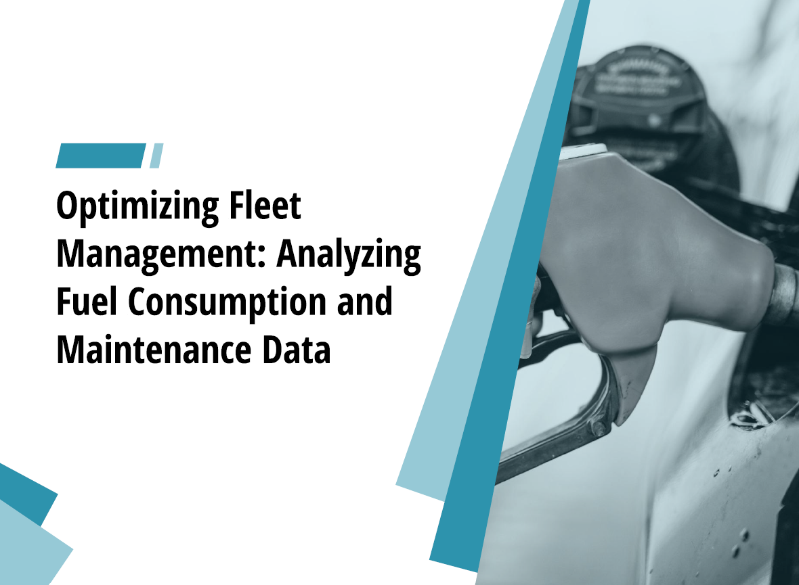
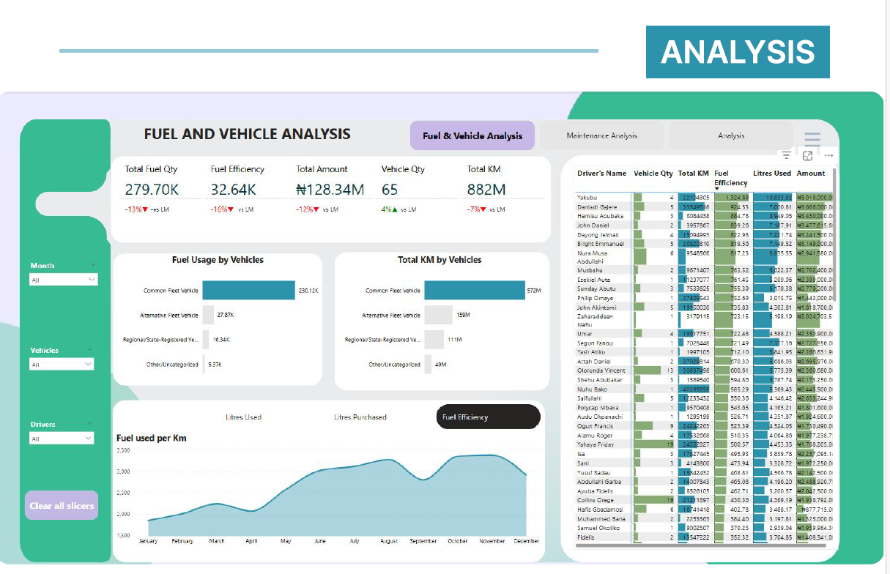
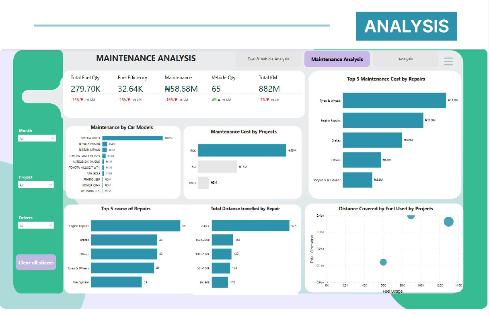
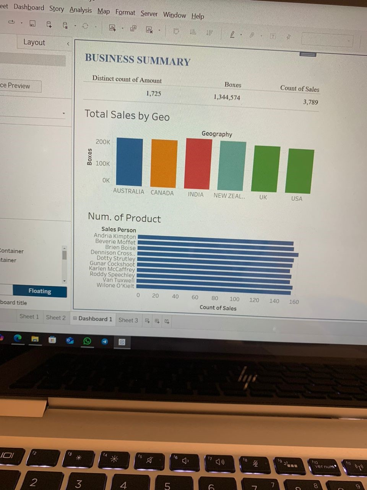

<!-- selection 1: Introduce yourself -->
## MY_PORTFOLIO

## ABOUT

 Hello, I am Rufai Raheem Adebola, hails from Ogun state, Nigeria. A highly motivated and detail-oriented graduate with a Higher National Diploma (HND) in Banking and Finance from The Polytechnic, Ibadan. With a strong foundation in financial principles, risk management and insight, and an emerging expertise in data analysis, I am passionate about leveraging technology to drive insights and improve decision-making processes.

## MY SKILLS 

**Data Analysis: Python, SQL, Power BI, and Excel.
Data Visualization and Cleaning.
Financial Analysis and Reporting.
Problem-Solving and Critical Thinking.
Eagerness to Learn and Adapt.
English (Advance in writing and fluent in speaking), Yoruba (Native).**

<!--Section 2: List 3-6 Key projects -->
## MY PROJECT

**Bakery Dataset on Sales**

Performed data cleaning on the Bakery dataset, analyze using key performance indicators (KPIs) of sales, and determine the organization's profit across different days of sales.

Dataset originated - Kaggle.com
Tools used - Microsoft Power BI
Data cleaning and Visualization - Microsoft Power BI.

**English Premier League analysis of 2023/2024 season**

Its a football game in which two teams of 11 players, using any part of their bodies except their hands and arms, try to maneuver the ball into the opposing team’s goal. Only the goalkeeper is permitted to handle the ball and may do so only within the penalty area surrounding the goal. The team that scores more goals wins. 
Football is the world’s most popular ball game in numbers of participants and spectators. The performance of each clubs and players for the whole season of English Premier league.

Dataset originated - Kaggle.com
Tools used - Microsoft Power BI
Data cleaning - Microsoft Excel
Visualization - Microsoft Power BI.

[ReadMore](https://www.linkedin.com/feed/update/urn:li:activity:7290888425598029825/)

**Optimizing Fleets Management Analysis on Fuel Consumption and Maintainace Data.**

Fleet management is crucial in maximising effective vehicles usage and monitoring fuel consumption to minimize vehicle missmanagement and ensure appropirate maintainace system. To achieve this, its essencial to uncover inefficiencies, optimize fuel usage, and streamline vehicle maintainace. This study seeks to spot trends in maintainace and fuel efficiency to inform data-driven decision making. Actionable strategies are being proposed to enhance fleet performance and mnimize costly downtime.

[ReadMore](Optimizing Fleet Performance...pdf)

## Tableau for Data Analysis.
Tableau for data analysis is the same as using Power BI and Excel all are use for Business Intelligence.

Tableau is a data visualization and business intelligence (BI) software that helps analyst turn raw data into interactive, easy-to-understand, charts, graphs, and dashboards.

[ReadMore](https://www.linkedin.com/feed/update/urn:li:activity:7334576778381860864/)

## CERTIFICATION

Certification of completion of a course is not just a piece of paper or documents but a dedication and hardwork to vent on new opportunities.

[Read More](https://www.linkedin.com/feed/update/urn:li:activity:7308861528642854913/)

## RECOMMENDATION.

It is a privilege to present my recommendation letter as a testament to my skills and expertise in Data Analysis. This serves as a valuable certification, enabling me to demonstrate my knowledge in any organization I find myself in. I remain open to new challenges and opportunities for growth.

## CONTACT DETAILS
**_Let's see how we can be of benefit to one another_**

________________________________________________________________________
<table>    E-mail - adebola.rufai@gmail.com </table>
________________________________________________________________________
<table>   Telphone (+234)-814-736-2706 </table>
________________________________________________________________________
<table>   Whatsapp (+234)-705-106-6456 </table>
________________________________________________________________________
<table>     12B, Degun street Ijebu-ode, Ogun state, Nigeria. </table>
________________________________________________________________________
<a href="Rufai_Raheem_Adebola CV.pdf"> My CV Download the Report here (pdf file)  </a>

 
