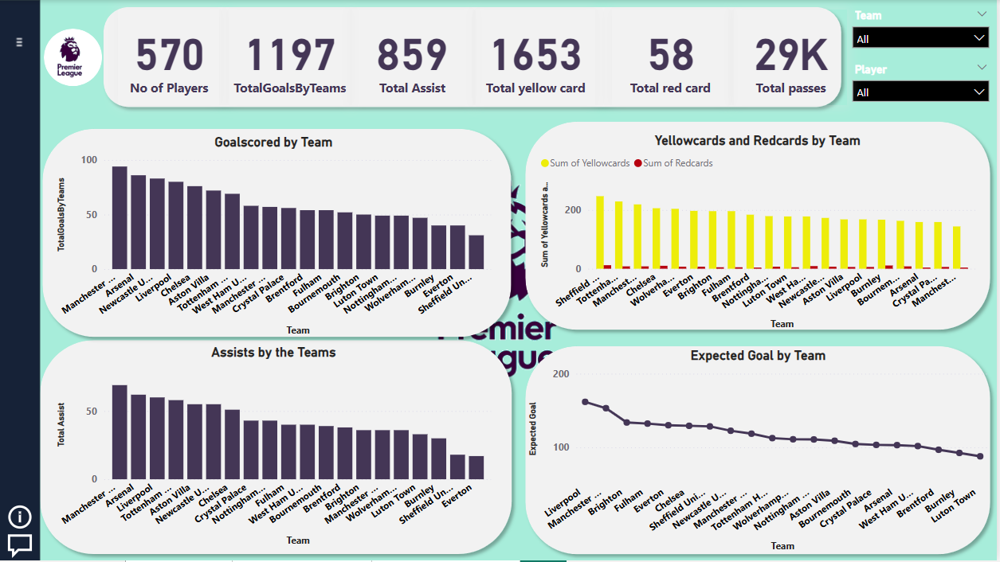

## MY_PORTFOLIO

## ABOUT

 Hello, I am Rufai Raheem Adebola, hails from Ogun state, Nigeria. A highly motivated and detail-oriented graduate with a Higher National Diploma (HND) in Banking and Finance from The Polytechnic Ibadan. With a strong foundation in financial principles and an emerging expertise in data analysis, I am passionate about leveraging technology to drive insights and improve decision-making processes.

## MY SKILLS 

**Data Analysis: Python, SQL, Power BI, and Excel.
Data Visualization and Cleaning.
Financial Analysis and Reporting.
Problem-Solving and Critical Thinking.
Eagerness to Learn and Adapt.**

## MY PROJECT

Performed data cleaning on the Bakery dataset, analyze using key performance indicators (KPIs) of sales, and determine the organization's profit across different days of sales.
Dataset originated - Kaggle.com
Tools used - Microsoft Power BI
Data cleaning and Visualization - Microsoft Power BI.

English Premier League analysis of 2023/2024 season, for the performance of each clubs and players for the whole season.
Dataset originated - Kaggle.com
Tools used - Microsoft Power BI
Data cleaning - Microsoft Excel.

![image]

 
